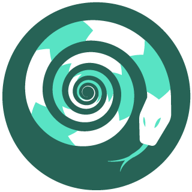

# ХАКАТОН ИНТЕРНЕТ СВОБОДЫ

# [ПОДАННЫЕ ПРОЕКТЫ](projects.md)

# Таймлайн

- [x] Сбор заявок - ~~до 27 мая~~ 30 МАЯ
- [ ] Формирование команд - с 31 мая по 4 июня
- [ ] Он-лайн хакатон - 4-7 июня
- [ ] Подведение итогов - с 8 по 14 июня
- [ ] Поддержка и развитие проектов-победителей - **один месяц**

---

## Оглавление
1. [Манифест](#manifest)

2. [Стримы Хакатона](#video)

3. [Участники](#participates)
  * [Разработчики и программисты](#develop)
  * [Журналисты и блогеры](#blogers)
  * [Аналитики](#analyzer)
  * [Художники и дизайнеры](#arts)
  
4. [Темы хакатона](#themes)
  * [Свобода слова](#freedom)
  * [Борьба с ботами](#bots)
  * [Мониторинг связности/доступности](#monitoring)
  * [Мониторинг властей](#powers)
  * [Информационная безопасность](#security)
  * [Аналитика и визуализация](#vizual)
  
5. [Процесс](#proccess)
  * [Сбор заявок участников](#request)
  * [Формирование команд](#team)
  * [Хакатон](#hack)
  * [Подведение итогов](#summary)
  * [Поддержка проектов](#support)
  
 6. [Ресурсы и обратная связь](#source)
---
# Манифест

Государство постоянно демонстрирует свою некомпетентность в интернете. Оно принимает невыполнимые законы, допускает масштабные утечки данных и вводит репрессивные меры, ограничивая свободу слова. Оно не видит реальных проблем и вместо того, чтобы развивать интернет, пытается взять его под контроль и испортить. Так происходит не только у нас, но гражданское общество в других странах может успешно этому противостоять. В России же, как правило, каждый сам за себя — но чтобы защитить свободный интернет, нам нужно объединяться. Проблем в российском интернете много: блокировки, атаки ботов, отсутствие механизмов контроля. Но и талантливых людей, способных их решить, не меньше. Мы хотим собрать вас всех вместе — и найти решения тех действительно важных и нужных задач, до которых нашему государству обычно нет дела.

---

# Стримы Хакатона

## Открытие Хакатона:

## Access Now, Наталья Крапива:

## ICANN, Михаил Анисимов:

## CIVIC-TECH, Ксения Ермошина:

## RIPE NCC, Алексий Семеняка:

## Визуализация, Ильдар Якубов:

---

# Участники

Мы зовём всех, кому важно развивать интернет в России и кто знает, как это делать. Если у вас есть идея проекта, на который постоянно не хватало времени или рук — настало время воплотить её в жизнь. Если вы готовы помочь сделать российский интернет лучше и безопаснее, но точно не знаете, как — присоединяйтесь к любой команде, которая вам понравится: задачи найдутся для всех.

## Разработчики и программисты
На нашем хакатоне можно кодить всё, что захочется, если это способно принести кому-то пользу или улучшить жизнь. Можно даже попробовать новый стек, который вы давно хотели освоить, но никак не хватало времени.
Аналитики
Больших массивов данных в нашей жизни много, а людей, которые умеют и любят с ними работать — не очень. Если это вы, то мы вас ждём. 

## Журналисты и блогеры
Написать скрипт или проанализировать данные — это полдела. Для того, чтобы проект был полезным, нужно доступно рассказать, какую проблему он решает. Даже если вы не умеете кодить или не пробовали себя в дата-журналистике, но знаете, как сделать сложное простым и понятным и превратить фактуру в интересный текст — приходите.

## Аналитики
Больших массивов данных в нашей жизни много, а людей, которые умеют и любят с ними работать — не очень. Если это вы, то мы вас ждём. 

## Художники и дизайнеры
Ни один проект не обходится без дизайна, особенно — в интернете. Если вы умеете рисовать инфографику, визуализировать данные и придумывать, как сделать красиво — мы вас ждём.

---

# Темы хакатона
Мы составили список основных тем хакатона. Вы можете выбрать одну из них — или предложить свою.

## 1. Свобода слова
Роскомнадзор неограниченно блокирует сайты в интернете, но пока не добрался до мобильных приложений. Однако, скоро случится и это: на днях в Госдуме снова рассматривали законопроект о блокировках приложений в App Store и Google Play. Сейчас рынок полезных социальных приложений активно развивается: от правозащитной «Красной кнопки» до интерактивных карт с мусорными свалками, создаваемых экоактивистами. Запрет ударит по всем: аудитория при блокировке теряется быстро, а создавать новое приложение — дорого и долго. 
Но решения есть. Например — универсальный конструктор приложений, который можно разработать на базе New Node. Любые СМИ, НКО и правозащитные организации с помощью этого конструктора смогут легко сделать своё приложение, которое Роскомнадзор не заблокирует никогда.

## 2. Борьба с ботами
Ещё одна проблема, с которой сталкиваются абсолютно все — это боты. Российские боты (и тролли) хорошо известны по всему миру. Они атакуют личные аккаунты в твиттере, страницы СМИ в фейсбуке, чаты в телеграме — и в итоге важные материалы и новости, о которых не расскажут на госканалах, тонут в информационном шуме. 
Хорошая новость в том, что бороться с ними можно. Для этого есть разные способы. Если вы знаете, как написать антибота, сделать плагин для браузера, который позволит легко от них избавляться или автоматизировать отправку жалоб в соцсетях — собирайте команду. А может, вы вообще хотите вскрыть работу очередной фабрики троллей и сделать расследование об этом — тогда вам тоже сюда.

## 3. Мониторинг связности/доступности
Государство всё ещё не отказалось от идеи суверенного интернета — хоть пандемия и затормозила процесс его внедрения. Для того, чтобы узнать об отключении интернета вовремя, ОЗИ постоянно меряет индекс связности. Но он основан на данных реестра, а если блокировки будут на уровне ТСПУ — мы не сможем заметить проблемы. Вопрос локальных шатдаунов индекс тоже не решает, а отключение связи — это первое, что делают власти в протестных регионах. 
Нам нужно быть готовыми к блокировкам и придумать способы мониторинга сети. Одно из решений — разработать инструмент, который будет проверять доступность интернет-ресурсов (может быть даже — в конкретных регионах), отображать изменения и складывать эти данные куда-то, где они будут надёжно защищены.

## 4. Мониторинг властей
Государство вроде бы отчитывается о своей работе — например, публикует госконтракты — но часто делает это так, что разобраться сложно. Кроме того, зная нашу власть, её нужно постоянно контролировать. Важные законопроекты выкладываются по-тихому — так, чтобы люди не увидели и не смогли возразить — дела о репостах на сайтах судов остаются незамеченными, а в госзакупках вообще чёрт ногу сломит.
Мы хотим разработать инструменты, которые помогут нам следить за тем, что делают госорганы и вовремя обнаруживать всё, что они пытаются скрыть. Это может быть парсер, который будет ходить по сайтам судов, или механизм отслеживания нормативных актов по борьбе с эпидемией. А если вы хотите помочь бороться с коррупцией, то нужно придумать, как мониторить сайт госзакупок — например, в конкретном регионе или по конкретным контрактам.

## 5. Информационная безопасность
О безопасности ваших данных не позаботится никто, кроме вас самих. Более того, многие люди даже не знают, что именно может случиться с данными, которые они предоставляют государству — например, когда получают цифровое разрешение на выход из дома. А это как минимум грозит утечками.
Самое важное, что нужно делать сейчас — это рассказывать людям, где в интернете опасно и почему — и как избежать рисков. Информационная безопасность должна стать базовым знанием — но для этого ей нужно придумать простые и понятные формы, а людям дать такие инструменты, которыми они смогут легко пользоваться в повседневной жизни. Если вы знаете, как это сделать — вам сюда.

## 6. Аналитика и визуализация
Даже в открытых государственных ресурсах очень много данных, которые никто не обрабатывает и не анализирует. А между тем, выводы, сделанные на данных и показанные красивой картинкой, часто гораздо более убедительны, чем тексты — пусть даже качественные. 
Собирать, обрабатывать и визуализировать данные умеют немногие — но если это вы, то ваша помощь очень нужна тем, кто хочет и любит исследовать разные явления. А может быть, вы знаете, как придумать инструмент, с которым журналистам или правозащитникам будет проще делать дата-материалы — тогда мы вас тоже очень ждём здесь.

---

# ПРОЦЕСС

## Сбор заявок участников
**Даты: 15 мая — 27 мая**

Регистрация на хакатон открыта! Для того чтобы принять участие, вам нужно заполнить анкету вот здесь. Вопросы несложные: главное — определиться, есть ли у вас идея своего проекта или вы хотите присоединиться к другой команде.
По мере получения заявок мы будем заводить папки проектов на гитхабе. Описания проектов, которые вы напишете в заявке, будут публиковаться на сайте. Прежде чем заполнить заявку, проверьте — нет ли этой идеи в списке.

[ФОРМА ДЛЯ ЗАЯВКИ](https://docs.google.com/forms/d/e/1FAIpQLSdf8i3hmmS5pacyhoLWv3TOggnO_-kkfCoBCFxw0InXukdscg/viewform?usp=sf_link)

## Формирование команд
**Даты: 27 мая — 4 июня**

Как только приём заявок закроется, начнётся этап формирования команд. Мы поможем вам найти нужных людей или нужную команду. 
Если своего проекта у вас нет, но вы готовы участвовать, открывайте папку на гитхабе и выбирайте идею, которая вам нравится. Чтобы присоединиться к команде, вам нужно связаться с её организатором — контакты вы найдёте в той же папке. 
Мы создадим отдельный чат для общения участников друг с другом и поиска свободных рук. Как только он появится, мы отправим вам ссылку и пригласим добавиться в него, чтобы найти команду или людей.
Новости хакатона мы будем выкладывать в соцсетях и в специальном канале в телеграме — подписывайтесь:

## Хакатон
**Даты: 5 июня — 7 июня**
Хакатон пройдёт онлайн. Он начнётся в 20:00 Мск 5 июня.
Но собраться вместе с командой вы можете заранее там, где вам удобно — в зуме, скайпе, отдельном чате — главное, чтобы вы были друг с другом на связи.
На разработку проекта будет отведено три дня. 7 июня в 20:00 хакатон завершится. К этому моменту мы будем ждать от вас готовый проект в readme.md и презентацию проекта. Презентация может быть в любом удобном вам формате (Google docs, например) — главное, чтобы из неё было понятно, что это за проект, как он будет работать и кому может быть полезен.

## Подведение итогов
**Даты: 7 июня — 14 июня**

Оценивать проекты будет жюри. В его состав войдут представители ОЗИ, RIPE NCC, Access Now и других организаций — список будет пополняться.
Жюри будет оценивать проекты по нескольким критериям: идея проекта, уровень его реализации, его социальная значимость, оформление и подача.
Через неделю после завершения хакатона мы объявим победителей.
Лучшие проекты получат призы от наших партнеров (информация дополняется).

## Поддержка проектов
**Даты: 15 июня — 15 июля**

В течение месяца после окончания хакатона мы будем поддерживать лучшие проекты. Мы поможем вам развить идею, найти хостинг, выйти на нужную аудиторию и сделать так, чтобы полезный и хороший проект заработал и о нём узнали как можно больше людей.

---
# Ресурсы и обратная связь

Официальный сайт: https://hackathon.ozi-ru.org/

Новостной телеграм-канал: https://t.me/hackathon_OZI

Общий телеграм-чат хакатона: https://t.me/discussion_hack_OZI

Если у вас остались вопросы, пишите нам: mail@ozi-ru.org 

Вопросы сотрудничества: https://t.me/klimarev
